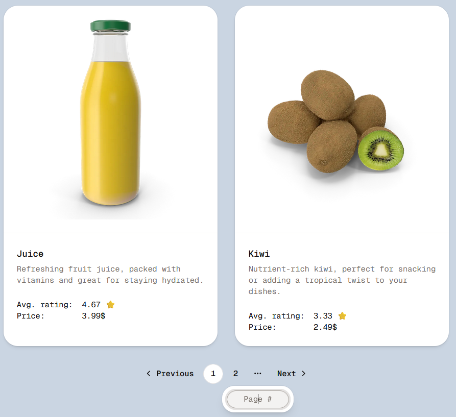

# Pagination Experiments

Exploring classic page-based pagination and infinite scroll.

## Learning Outcomes

- classic pagination for fetching products from the [DummyJSON API](https://dummyjson.com/docs/products), with a page jump and a custom pagination hook;
- infinite scroll for fetching Pokemon from [PokeAPI v2](https://pokeapi.co/), using react-intersection-observer and React Query's useInfiniteQuery;
- p-limit to cap concurrent image fetches;
- zod to validate request responses through axios;
- shadcn, Tailwind for some minimal styling;

## Screenshots

### Page-Based Pagination

### Infinite Scroll

